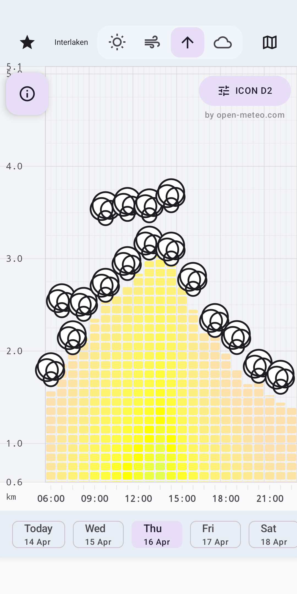
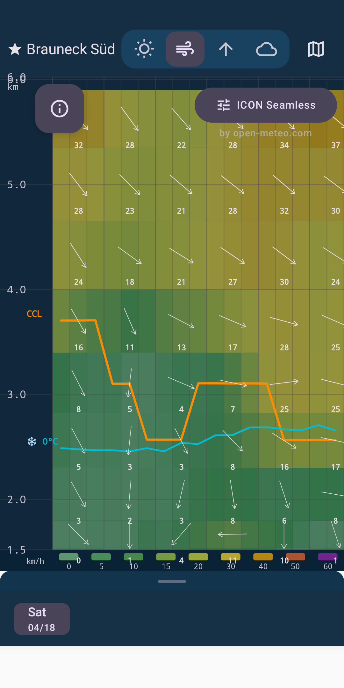
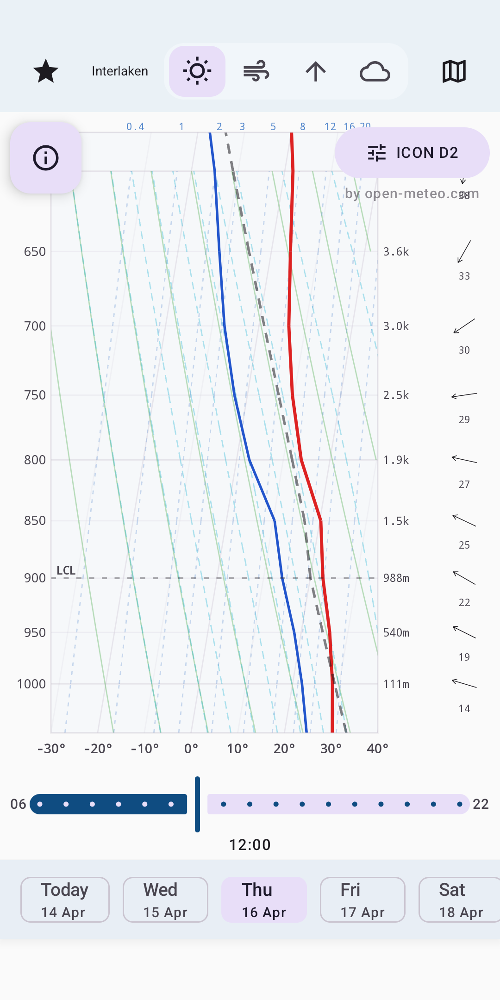
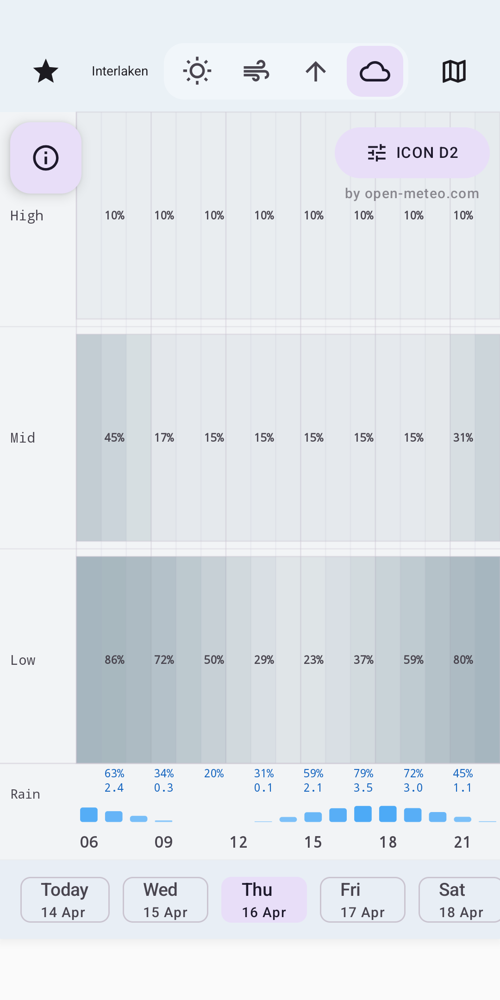

# Cloudbase Predictor

Weather forecast app for soaring and free-flight pilots (paragliding, hang-gliding, sailplanes).

Built with Jetpack Compose, it visualises atmospheric sounding data from [Open-Meteo](https://open-meteo.com/) so you can quickly assess thermic conditions, wind profiles, and cloud cover for your flying site.

<p align="center">
  
  
  
  
</p>

## Features

- **Thermic forecast** — thermal strength and height across the day with cloudbase estimate
- **Wind forecast** — wind speed and direction at every pressure level, colour-coded
- **Stüve diagram** — classic atmospheric sounding plot with temperature and dew-point profiles
- **Cloud forecast** — cloud cover at low, mid, and high levels
- **Multiple models** — ICON Seamless, ICON D2, GFS Seamless, and more via Open-Meteo
- **Favourite places** — save your flying sites and switch between them instantly
- **Interactive map** — pick any location on the map to get a forecast
- **Pinch-to-zoom** — adjust the visible altitude range on all chart views
- **Dark theme** — full Material 3 dark-mode support

## Building

```bash
git clone https://github.com/Dmitry-Borodin/CloudbasePredictor.git
cd CloudbasePredictor
./gradlew :app:assembleDebug
```

## Testing

```bash
# Unit tests (JVM)
./gradlew :app:testDebugUnitTest --rerun

# Instrumentation tests (requires emulator)
./gradlew :app:connectedInstrumentationTest --rerun
```

## Data Source

All weather data is provided by [Open-Meteo](https://open-meteo.com/) — an open-source weather API.

## License

This project is licensed under the [GNU General Public License v3.0](LICENSE).
